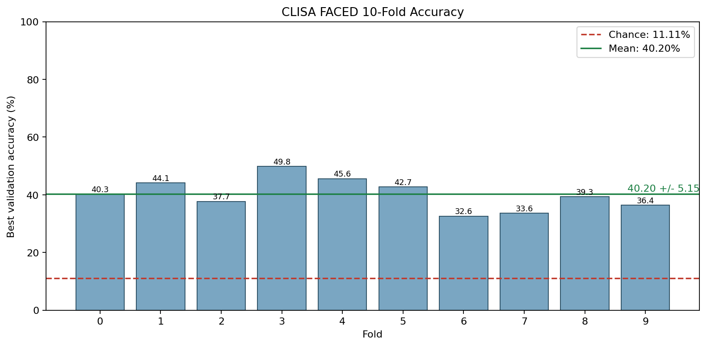
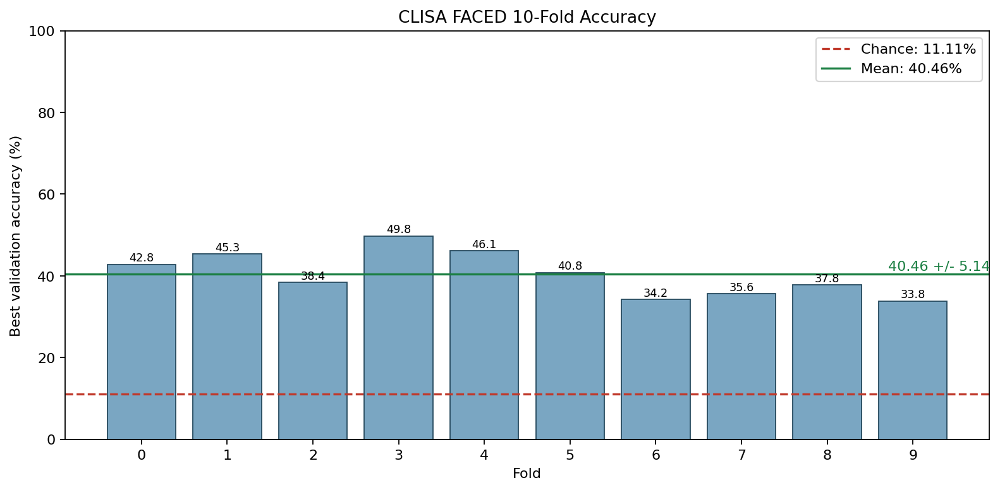
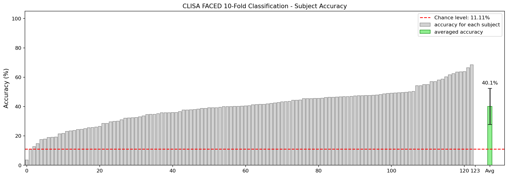
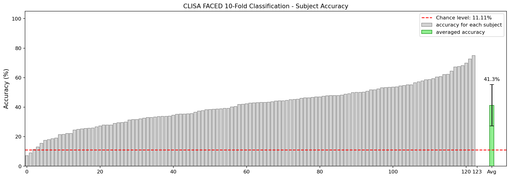
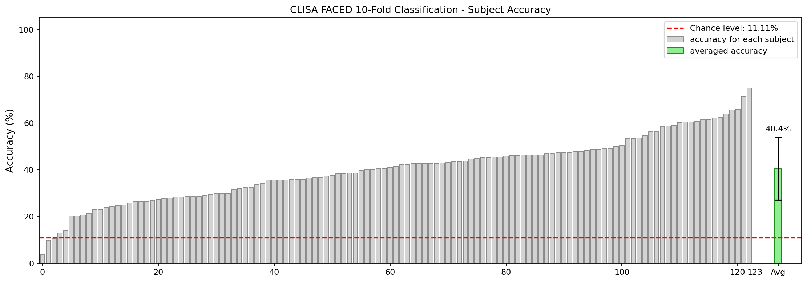
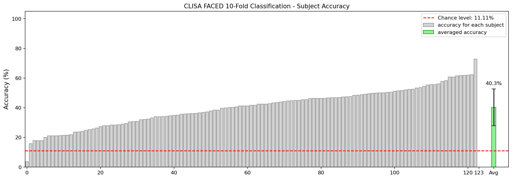
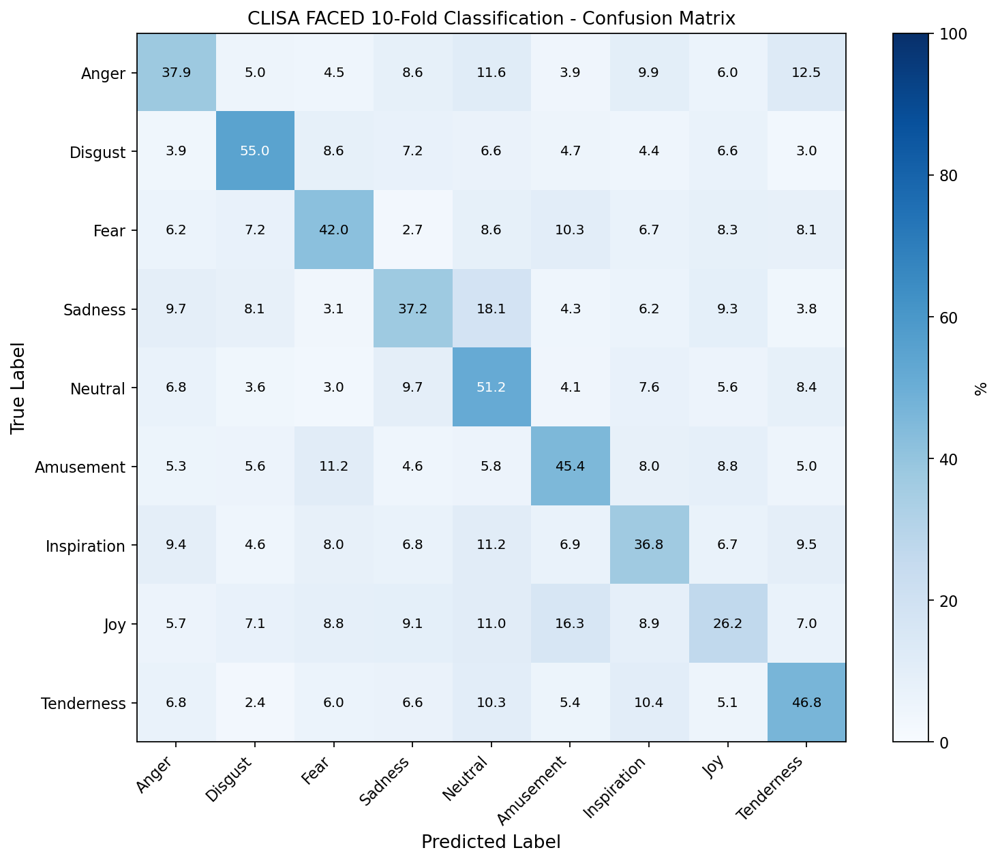
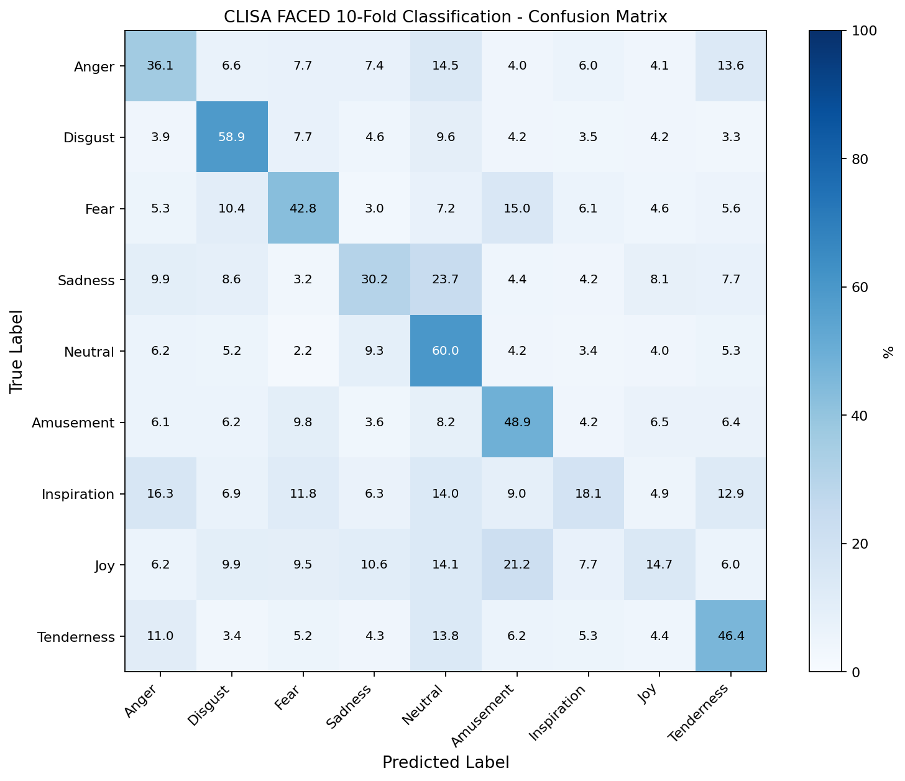

# CLISA EEG Emotion Reproduction

本仓库提供 CLISA 在 FACED 9-class EEG 情感识别任务上的复现代码、配置、运行脚本和轻量级结果文件。准备 FACED processed data 后，可按 README 放置数据并完整执行：

```text
pretrain -> extract_fea -> train_mlp -> visualize
```

仓库目前整理了五个可对照的 CLISA 实验结果：一个 0.05-47 Hz 顺序 reference、两个 fold-parallel 复现结果，以及两个 4-47 Hz paper-style pretrain 后的最佳 MLP 补充结果。原始输入数据和大体积中间特征不纳入版本管理；代码、配置、汇总指标、轻量预测文件和可视化结果保留在仓库中，便于核对实验设置与结果。

## 快速复现

1. 克隆仓库并进入目录。

```bash
git clone https://github.com/LJL-6666/clisa-eeg-emotion.git
cd clisa-eeg-emotion/Clisa_analysis   # CLISA 代码位于该子目录
```

2. 创建环境。

```bash
conda env create -f environment.yml
conda activate clisa-code
```

如果不使用 conda，可退回到：

```bash
pip install -r requirements.txt
```

3. 放置 FACED processed data。

默认 0.05-47 Hz 数据放在：

```text
runtime_inputs/Processed_data/
  sub000.pkl
  sub001.pkl
  ...
  sub122.pkl
```

代码同时支持 `sub*.pkl` 和 `sub*.mat`。仓库已经包含 `runtime_inputs/after_remarks/sub*/After_remarks.mat`，一般不需要额外准备。

4. 运行默认复现协议。

```bash
CONDA_ENV=clisa-code bash scripts/run_local_faced_reference.sh
```

输出会写入 `runs/run_<UTC time>/`，其中 `visualization/` 下会生成 fold accuracy、subject accuracy 和 confusion matrix。

## 结果总览

五个实验使用同一个 FACED 9-class cross-subject 任务，但数据频段、执行协议或 MLP 设置不同。指标均来自对应目录下的 `visualization/daest_faced_visualization_summary_de.json` 或补充结果汇总文件。

| ID | 实验口径 | 数据分支 | 执行协议 | 结果目录 | 10-fold mean | overall | subject mean +/- std |
| --- | --- | --- | --- | --- | ---: | ---: | ---: |
| E1 | Reference | 0.05-47 Hz `Processed_data` | single-process sequential 10-fold | `results/processed_data_full_fixed_v4_lds_forward/` | `42.5230%` | `42.3790%` | `42.3790% +/- 13.6889%` |
| E2 | Fold-parallel | 4-47 Hz `Processed_data-clisa` | 10 folds launched across GPUs | `runs/run_6gpu_full_current/` | `40.1986%` | `40.1055%` | `40.1055% +/- 12.3194%` |
| E3 | Fold-parallel | 0.05-47 Hz `Processed_data` | 10 folds launched across GPUs | `runs/run_processed_005_47_full_current/` | `41.4222%` | `41.2505%` | `41.2505% +/- 14.0089%` |
| E4 | Paper-style pretrain + current MLP | 4-47 Hz `Processed_data-clisa` | 100-epoch paper-style pretrain/extract, then MLP `[128,64]` | `results/paper_pretrain_mlp_sweep_20260605/current_default/` | `40.5944%` | `40.4288%` | `40.4288% +/- 13.4293%` |
| E5 | Paper-style pretrain + paper MLP | 4-47 Hz `Processed_data-clisa` | 100-epoch paper-style pretrain/extract, then MLP `[30,30]` | `results/paper_pretrain_mlp_sweep_20260605/paper_30_30_wd0011/` | `40.4581%` | `40.2962%` | `40.2962% +/- 12.3983%` |

详细的 fold-level score、路径和运行来源见 [docs/run_history.md](docs/run_history.md)。E4/E5 的补充结果说明和轻量产物见 [`results/paper_pretrain_mlp_sweep_20260605/README.md`](results/paper_pretrain_mlp_sweep_20260605/README.md)。

E4/E5 使用的 paper-style pretrain/extract 设置为 `train.wd=0.015`、`train.restart_times=3`、`train.max_epochs=100`、`patience=30`；随后在同一组 extracted features 上比较两个保留 MLP case。这组结果用于对照 paper-style pretrain 和 MLP 设置敏感性，不替代 E1 的 0.05-47 Hz reference 主结果。

> 对照基线：FACED 官方 **DE+SVM** 见 [`../Svm_analysis/`](../Svm_analysis/)。9 类跨被试 39.4%（本仓库 CLISA 42.5%）；完整四配置（9/2 类 × cross/intra）结果见该目录 [README](../Svm_analysis/README.md)。

## 仓库结构

| 路径 | 作用 |
| --- | --- |
| `main.py` | 推荐的本地统一入口，串联四个阶段。 |
| `train_ext.py` | CLISA 对比学习预训练。 |
| `extract_fea.py` | 特征提取、running normalization、LDS smoothing。 |
| `train_mlp.py` | 下游 MLP 分类器训练。 |
| `visualize_daest_results.py` | 聚合预测结果并生成可视化。 |
| `cfgs/` | Hydra 配置。 |
| `data/`, `model/`, `utils/` | 数据读取、模型和工具函数。 |
| `../preprocessing/` | 可选的 FACED raw EEG 到 processed data 预处理流程（位于仓库根，CLISA 与 DE+SVM 共享）。 |
| `runtime_inputs/after_remarks` | 已随仓库提供的 FACED 视频顺序和备注文件。 |
| `runtime_inputs/Processed_data` | 默认 0.05-47 Hz processed data 放置目录；数据文件不纳入版本管理。 |
| `runtime_inputs/Processed_data-clisa` | 可选 4-47 Hz CLISA 分支数据目录；数据文件不纳入版本管理。 |
| `results/` | 历史参考结果和可视化输出。 |
| `runs/` | 复现实验输出目录，保留轻量级指标、日志和可视化文件。 |

## 数据准备

FACED 数据集需要用户自行下载和放置，仓库不分发原始或 processed EEG 数据。可参考 FACED 数据链接：<https://cloud.tsinghua.edu.cn/d/4b573279ab1d4e9fb04a/>。

默认复现使用 `runtime_inputs/Processed_data`，对应 0.05-47 Hz processed data。历史参考结果和 0.05-47 Hz fold-parallel 复现均使用该数据分支。

如果要复现 4-47 Hz CLISA 分支，需要额外准备：

```text
runtime_inputs/Processed_data-clisa/
  sub000.pkl
  ...
  sub122.pkl
```

数据目录必须包含 123 个 subject 文件，编号从 `sub000` 到 `sub122`。如果数据放在其他位置，运行时显式传入 `DATA_ROOT=/abs/path/to/Processed_data` 或 `--data-root /abs/path/to/Processed_data` 即可。

如需从 FACED raw EEG 生成 processed data，可以使用预处理流程：

```bash
cd ../preprocessing
python main.py --clisa-or-not yes
```

`--clisa-or-not yes` 会在 ICA 等步骤之后同时写出主分支和 4-47 Hz CLISA 分支。运行前需要根据本地实际路径修改 `../preprocessing/main.py` 里的 `foldPaths`、`data_dir`、`save_dir` 和 `clisa_save_dir`。更多说明见 [../preprocessing/README.md](../preprocessing/README.md)。

## 复现能力与限制

别人克隆仓库后可以直接查看五个实验的轻量结果、汇总指标和可视化图；从零复现实验则必须自行准备 FACED processed data。仓库不分发原始 EEG、processed data、大体积 extracted features 或新补充实验的 checkpoints。

可复现边界如下：

- E1/E3 需要 0.05-47 Hz `runtime_inputs/Processed_data/sub000.pkl` 到 `sub122.pkl`。
- E2/E4/E5 需要 4-47 Hz `runtime_inputs/Processed_data-clisa/sub000.pkl` 到 `sub122.pkl`。
- E4/E5 需要先运行一次 paper-style `pretrain -> extract_fea` 生成 feature run root，再在该 run root 上跑 MLP。
- 代码和脚本可复现完整流程；由于 GPU、PyTorch/CUDA、随机数轨迹和 fold-parallel 启动方式可能不同，重新训练结果不保证逐位一致。
- 如需严格比较，固定相同数据分支、运行入口、seed、`run-id`、`pretrain-checkpoint`、`lds-given-all` 和执行协议。

## 复现命令

### 五个实验入口

| ID | 复现入口 | 必需数据 | 输出说明 |
| --- | --- | --- | --- |
| E1 | `scripts/run_local_faced_reference.sh` | `runtime_inputs/Processed_data` | 新输出写入 `runs/run_<UTC time>/`。 |
| E2 | `scripts/run_faced_fold_parallel_4_47.sh` | `runtime_inputs/Processed_data-clisa` | 建议把 `OUTPUT_RUN_ROOT` 改成新目录，避免覆盖现有结果。 |
| E3 | `scripts/run_faced_fold_parallel_005_47.sh` | `runtime_inputs/Processed_data` | 建议把 `OUTPUT_RUN_ROOT` 改成新目录，避免覆盖现有结果。 |
| E4 | `scripts/run_4_47_paper_pretrain_extract_background.sh` -> `scripts/run_4_47_paper100_best2_mlp.py --cases current_default` | `runtime_inputs/Processed_data-clisa` | 输出写入 `runs/mlp_sweeps/<sweep-name>/4_47_paper100/current_default/`。 |
| E5 | `scripts/run_4_47_paper_pretrain_extract_background.sh` -> `scripts/run_4_47_paper100_best2_mlp.py --cases paper_30_30_wd0011` | `runtime_inputs/Processed_data-clisa` | 输出写入 `runs/mlp_sweeps/<sweep-name>/4_47_paper100/paper_30_30_wd0011/`。 |

### E1：顺序 10-fold reference（0.05-47 Hz）

该协议与历史参考结果使用相同的数据频段和顺序执行方式，适合用于 reference comparison。

```bash
CONDA_ENV=clisa-code bash scripts/run_local_faced_reference.sh
```

等价的显式入口：

```bash
python main.py \
  --data-root ./runtime_inputs/Processed_data \
  --after-remarks-dir ./runtime_inputs/after_remarks \
  --output-root ./runs \
  --data-config FACED_def \
  --model-config cnn_clisa \
  --valid-method 10 \
  --run-id 1 \
  --pretrain-epochs 80 \
  --mlp-epochs 100 \
  --extract-batch-size 2048 \
  --mlp-batch-size 512 \
  --mlp-wd 0.0022 \
  --pretrain-checkpoint best \
  --num-workers 0 \
  --lds-given-all 0
```

### E2：fold-parallel 复现（4-47 Hz）

该脚本将 10 个 fold 拆分为独立进程，并通过 `CLISA_FOLDS` 分配到可用 GPU，适用于 4-47 Hz CLISA 数据分支。

```bash
CONDA_ENV=clisa-code \
DATA_ROOT=./runtime_inputs/Processed_data-clisa \
OUTPUT_RUN_ROOT=./runs/run_6gpu_full_current \
bash scripts/run_faced_fold_parallel_4_47.sh
```

### E3：fold-parallel 复现（0.05-47 Hz）

该脚本适用于 0.05-47 Hz processed data，并包含输出目录保护，避免将结果写入 4-47 Hz 分支的输出目录。

```bash
CONDA_ENV=clisa-code \
DATA_ROOT=./runtime_inputs/Processed_data \
OUTPUT_RUN_ROOT=./runs/run_processed_005_47_full_current \
bash scripts/run_faced_fold_parallel_005_47.sh
```

如需重新运行 E2/E3，请将 `OUTPUT_RUN_ROOT` 改为新的目录，避免覆盖已有输出。

### E4/E5：4-47 Hz paper-style pretrain + best2 MLP

第一步运行 paper-style pretrain 和 feature extraction。脚本默认使用 `runtime_inputs/Processed_data-clisa`，输出到新的 `runs/run_4_47_paper_pretrain_extract_<UTC time>/`：

```bash
CONDA_ENV=clisa-code \
DATA_SRC=./runtime_inputs/Processed_data-clisa \
DEVICES='[0]' \
bash scripts/run_4_47_paper_pretrain_extract_background.sh
```

脚本会后台启动任务，并在终端打印 `Run root`、日志路径和状态文件。等待 `stage_status/pretrain.done` 和 `stage_status/extract.done` 都生成后，再运行 MLP。

运行 E4：

```bash
python scripts/run_4_47_paper100_best2_mlp.py \
  --source-run-root /abs/path/to/runs/run_4_47_paper_pretrain_extract_YYYYMMDDTHHMMSSZ \
  --output-root ./runs/mlp_sweeps \
  --sweep-name paper_pretrain_4_47_best2 \
  --cases current_default \
  --devices '[0]'
```

运行 E5：

```bash
python scripts/run_4_47_paper100_best2_mlp.py \
  --source-run-root /abs/path/to/runs/run_4_47_paper_pretrain_extract_YYYYMMDDTHHMMSSZ \
  --output-root ./runs/mlp_sweeps \
  --sweep-name paper_pretrain_4_47_best2 \
  --cases paper_30_30_wd0011 \
  --devices '[0]'
```

如果不传 `--cases`，脚本默认连续运行 E4 和 E5 两个 case。每个 case 的输出目录包含 `stage_logs/`、`stage_status/`、`SWEEP_CASE.json` 和 `visualization/daest_faced_visualization_summary_de.json`；汇总表写入 sweep 根目录下的 `summary.csv` 和 `summary.json`。

## 分阶段运行

仅运行预训练：

```bash
python main.py \
  --data-root ./runtime_inputs/Processed_data \
  --after-remarks-dir ./runtime_inputs/after_remarks \
  --output-root ./runs \
  --data-config FACED_def \
  --model-config cnn_clisa \
  --valid-method 10 \
  --run-id 1 \
  --pretrain-epochs 80 \
  --mlp-epochs 100 \
  --extract-batch-size 2048 \
  --mlp-batch-size 512 \
  --mlp-wd 0.0022 \
  --pretrain-checkpoint best \
  --num-workers 0 \
  --lds-given-all 0 \
  --stages pretrain
```

在已有 `run_root` 上继续跑 `extract + mlp + visualize`：

```bash
python main.py \
  --resume-run-root /abs/path/to/runs/run_YYYYMMDDTHHMMSSZ \
  --lds-given-all 0 \
  --pretrain-checkpoint best \
  --stages extract,mlp,visualize
```

如果预训练是外部进程继续补齐的，可以等待所有 fold 的 `last.ckpt` 达到目标 epoch 后再继续：

```bash
python main.py \
  --resume-run-root /abs/path/to/runs/run_YYYYMMDDTHHMMSSZ \
  --lds-given-all 0 \
  --pretrain-checkpoint best \
  --stages extract,mlp,visualize \
  --wait-pretrain-last-epochs 80
```

仅重新生成可视化：

```bash
python main.py \
  --resume-run-root /abs/path/to/runs/run_YYYYMMDDTHHMMSSZ \
  --stages visualize \
  --force-stages visualize
```

也可以直接调用可视化脚本：

```bash
python visualize_daest_results.py \
  --run-root /abs/path/to/run_root \
  --run 1 \
  --mode de \
  --device cpu
```

## 输出目录

每次完整运行会生成一个独立 `run_root`：

```text
runs/<run_id_or_timestamp>/
  checkpoints/
  data/
  hydra_runs/
  stage_logs/
  stage_status/
  visualization/
  run.log
```

关键结果文件：

| 文件 | 说明 |
| --- | --- |
| `visualization/daest_faced_visualization_summary_de.json` | overall、subject mean/std、fold mean 等汇总指标。 |
| `visualization/daest_faced_10fold_fold_accuracy_de.png` | 10-fold 准确率图。 |
| `visualization/daest_faced_10fold_subject_accuracy_de.png` | subject-level 准确率图。 |
| `visualization/daest_faced_10fold_cls9_confusion_de.png` | 9-class confusion matrix。 |
| `stage_logs/*.log` | 各阶段运行日志。 |

## 可视化结果

下列图片按 E1-E5 并列展示，便于比较 fold accuracy、subject accuracy 和 confusion matrix。图片使用 HTML 控制宽度，GitHub README 中会按列缩放显示。

### Fold accuracy

<table>
  <tr>
    <th>E1<br>Reference<br>0.05-47 Hz</th>
    <th>E2<br>Fold-parallel<br>4-47 Hz</th>
    <th>E3<br>Fold-parallel<br>0.05-47 Hz</th>
    <th>E4<br>Paper-style<br>current MLP</th>
    <th>E5<br>Paper-style<br>30x30 MLP</th>
  </tr>
  <tr>
    <td></td>
    <td></td>
    <td></td>
    <td></td>
    <td></td>
  </tr>
</table>

### Subject accuracy

<table>
  <tr>
    <th>E1<br>Reference<br>0.05-47 Hz</th>
    <th>E2<br>Fold-parallel<br>4-47 Hz</th>
    <th>E3<br>Fold-parallel<br>0.05-47 Hz</th>
    <th>E4<br>Paper-style<br>current MLP</th>
    <th>E5<br>Paper-style<br>30x30 MLP</th>
  </tr>
  <tr>
    <td></td>
    <td></td>
    <td></td>
    <td></td>
    <td></td>
  </tr>
</table>

### Confusion matrix

<table>
  <tr>
    <th>E1<br>Reference<br>0.05-47 Hz</th>
    <th>E2<br>Fold-parallel<br>4-47 Hz</th>
    <th>E3<br>Fold-parallel<br>0.05-47 Hz</th>
    <th>E4<br>Paper-style<br>current MLP</th>
    <th>E5<br>Paper-style<br>30x30 MLP</th>
  </tr>
  <tr>
    <td></td>
    <td></td>
    <td></td>
    <td></td>
    <td></td>
  </tr>
</table>

## 实验设置对照

| 设置 | E1 reference | E2 fold-parallel 4-47 Hz | E3 fold-parallel 0.05-47 Hz | E4/E5 paper-style pretrain |
| --- | --- | --- | --- | --- |
| Dataset config | `FACED_def` | `FACED_def` | `FACED_def` | `FACED_def` |
| Model config | `cnn_clisa` | `cnn_clisa` | `cnn_clisa` | `cnn_clisa` |
| Task | FACED 9-class, 10-fold cross-subject | same | same | same |
| Data branch | 0.05-47 Hz `Processed_data` | 4-47 Hz `Processed_data-clisa` | 0.05-47 Hz `Processed_data` | 4-47 Hz `Processed_data-clisa` |
| Execution | single-process sequential | fold-parallel | fold-parallel | pretrain/extract once, then MLP sweep |
| Pretrain epochs | `80` | `80` | `80` | `100` |
| Pretrain lr | `0.0007` | `0.0007` | `0.0007` | `0.0007` |
| Pretrain weight decay | `0.00015` | `0.00015` | `0.00015` | `0.015` |
| Scheduler restarts | default config | default config | default config | `train.restart_times=3` |
| Feature mode | `de` | `de` | `de` | `de` |
| Running normalization | `ext_fea.use_running_norm=True` | same | same | same, `rn_decay=0.990` |
| LDS | `ext_fea.use_lds=True`, `lds_given_all=0` | same | same | same |
| Pretrain checkpoint for extraction | `best` | `best` | `best` | `best` |
| MLP setting | `[128,64]`, dropout `0.1`, wd `0.0022`, batch `512` | same | same | E4: same as current default; E5: `[30,30]`, dropout `0`, wd `0.011`, batch `256` |
| MLP epochs | `100` | `100` | `100` | `100` |

E1-E3 的训练命令设置 `min_epochs=max_epochs`，因此会按固定 epoch 完成训练；`patience` 不会触发提前停止。E4/E5 的 paper-style pretrain 脚本设置 `train.max_epochs=100` 和 `train.patience=30`，用于对齐论文/参考代码方向。LDS 在每个 video sequence 内做平滑，不跨 video 平滑。

## 版本管理范围

已纳入 GitHub 仓库：

- 代码、配置、启动脚本、README 和 docs。
- 可视化 PNG、CSV、JSON 汇总、小体积 prediction `.npz`。
- stage logs、Hydra 配置和轻量 checkpoint。

未纳入版本管理：

- FACED processed data：`runtime_inputs/Processed_data*`。
- 大体积 sliced arrays：`runs/*/data/sliced_data/`。
- 大体积 extracted feature arrays：`runs/*/data/ext_fea/`。

上述路径已写入 `.gitignore`，避免误提交大文件。

## 复现注意事项

- 历史参考结果使用 0.05-47 Hz processed data 和顺序 10-fold 协议，不应与 4-47 Hz CLISA 分支混作同一数据口径。
- Fold-parallel 协议可缩短运行时间；由于每个 fold 由独立进程执行，随机数推进顺序与单进程顺序协议不同，结果不保证逐位一致。
- 如需与历史参考结果严格对比，建议使用顺序 10-fold 0.05-47 Hz 协议生成新的 `runs/` 输出目录。
- 横向比较实验时应固定 `data-root`、`after-remarks-dir`、`run-id`、`pretrain-checkpoint`、`lds-given-all` 和执行方式。
