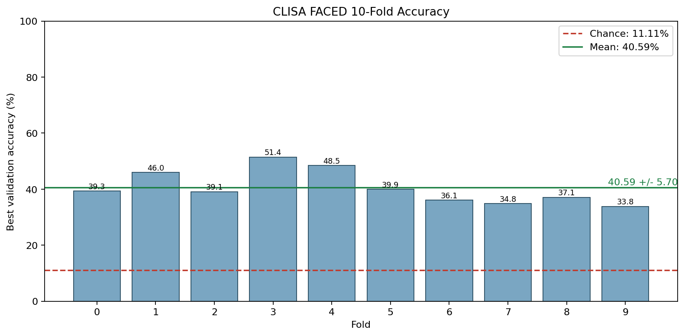
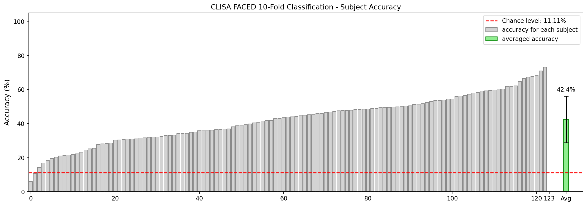
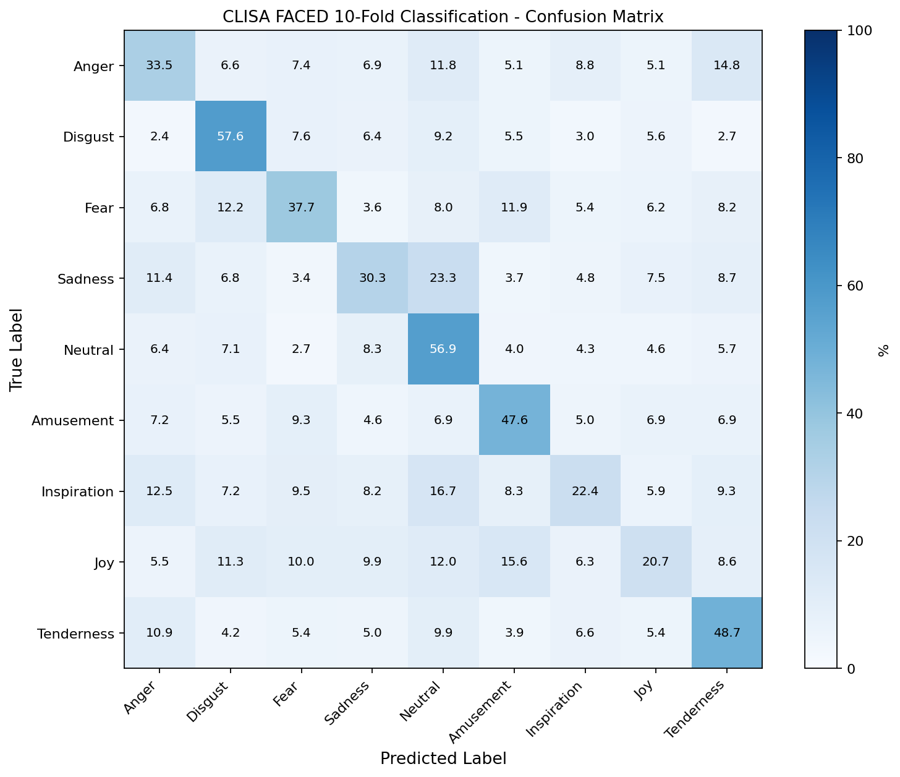

# CLISA EEG Emotion Reproduction

本仓库提供 CLISA 在 FACED 9-class EEG 情感识别任务上的复现代码、配置、运行脚本和轻量级结果文件。准备 FACED processed data 后，可完整执行：

```text
pretrain -> extract_fea -> train_mlp -> visualize
```

仓库目前整理了 5 个可对照的 CLISA 复现 variant。统一输出根只有一个：`runs/variants/`。每个 variant 下的 `published/` 保存已发布轻量结果，新运行写入同一 variant 下的新 `run_<UTC>/` 目录。

## 快速复现

```bash
git clone https://github.com/LJL-6666/clisa-eeg-emotion.git
cd clisa-eeg-emotion/Clisa_analysis
conda env create -f environment.yml
conda activate clisa-code
python scripts/run_reproduction_variant.py --list
python scripts/run_reproduction_variant.py --variant clisa_00547_seq_default_mlp128
```

默认 0.05-47 Hz 数据放在：

```text
runtime_inputs/Processed_data/
  sub000.pkl
  ...
  sub122.pkl
```

4-47 Hz CLISA 分支数据放在：

```text
runtime_inputs/Processed_data-clisa/
  sub000.pkl
  ...
  sub122.pkl
```

统一入口会在真实运行前检查数据目录。`clisa_00547_seq_default_mlp128` 和两个 paper-style variant 支持 `sub*.pkl` 或 `sub*.mat`；两个 fold-parallel variant 当前底层脚本要求完整的 `sub000.pkl` 到 `sub122.pkl`。仓库已经包含 `runtime_inputs/after_remarks/sub*/After_remarks.mat`，一般不需要额外准备。

## Variant 命名

命名规则见 [docs/variant_naming.md](docs/variant_naming.md)：

```text
clisa_<band>_<execution>_<pretrain>_<mlp>
```

| Variant id | 数据分支 | 执行方式 | 预训练 | MLP |
| --- | --- | --- | --- | --- |
| `clisa_00547_seq_default_mlp128` | 0.05-47 Hz | sequential 10-fold | default | current `[128,64]` |
| `clisa_447_fold_default_mlp128` | 4-47 Hz | fold-parallel | default | current `[128,64]` |
| `clisa_00547_fold_default_mlp128` | 0.05-47 Hz | fold-parallel | default | current `[128,64]` |
| `clisa_447_seq_paperpre_mlp128` | 4-47 Hz | paper pretrain/extract + MLP | paper-style | current `[128,64]` |
| `clisa_447_seq_paperpre_mlp30_wd0011` | 4-47 Hz | paper pretrain/extract + MLP | paper-style | paper `[30,30]`, wd `0.011` |

## 结果总览

根 [README.md](../README.md) 两方案横向对比统一使用 **subject mean**（下表第三列 `overall` / 第四列 subject mean 在本任务中数值相同）。

| Variant id | 10-fold mean | overall / subject mean | subject mean +/- std |
| --- | ---: | ---: | ---: |
| `clisa_00547_seq_default_mlp128` | `42.5230%` | `42.3790%` | `42.3790% +/- 13.6889%` |
| `clisa_447_fold_default_mlp128` | `40.1986%` | `40.1055%` | `40.1055% +/- 12.3194%` |
| `clisa_00547_fold_default_mlp128` | `41.4222%` | `41.2505%` | `41.2505% +/- 14.0089%` |
| `clisa_447_seq_paperpre_mlp128` | `40.5944%` | `40.4288%` | `40.4288% +/- 13.4293%` |
| `clisa_447_seq_paperpre_mlp30_wd0011` | `40.4581%` | `40.2962%` | `40.2962% +/- 12.3983%` |

详细 fold-level score 和运行来源见 [docs/run_history.md](docs/run_history.md)。

## 仓库结构

| 路径 | 作用 |
| --- | --- |
| `main.py` | 本地统一入口，串联四个阶段。 |
| `scripts/run_reproduction_variant.py` | 推荐入口，按 variant id 启动复现。 |
| `scripts/run_4_47_paper100_best2_full_pipeline.sh` | 4-47 Hz paper-style pretrain + two MLP final pipeline。 |
| `train_ext.py` | CLISA 对比学习预训练。 |
| `extract_fea.py` | 特征提取、running normalization、LDS smoothing。 |
| `train_mlp.py` | 下游 MLP 分类器训练。 |
| `visualize_daest_results.py` | 聚合预测结果并生成可视化。 |
| `runtime_inputs/Processed_data` | 默认 0.05-47 Hz processed data 放置目录；数据文件不纳入版本管理。 |
| `runtime_inputs/Processed_data-clisa` | 可选 4-47 Hz CLISA 分支数据目录；数据文件不纳入版本管理。 |
| `runs/variants/` | 唯一 CLISA 输出根。 |

## 复现命令

### 统一入口

```bash
python scripts/run_reproduction_variant.py --list
python scripts/run_reproduction_variant.py --variant clisa_00547_seq_default_mlp128
python scripts/run_reproduction_variant.py --variant clisa_447_fold_default_mlp128
python scripts/run_reproduction_variant.py --variant clisa_00547_fold_default_mlp128
python scripts/run_reproduction_variant.py --variant clisa_447_seq_paperpre_mlp128
python scripts/run_reproduction_variant.py --variant clisa_447_seq_paperpre_mlp30_wd0011
```

5 个 variant 都可以用同一个 `--variant` 入口直接选择运行。Paper-style 两个 variant 会先自动运行 4-47 Hz paper-style pretrain/extract，等待 `paper_pretrain_extract/stage_status/extract.done`，再继续跑所选 MLP case。

如果已经有完成的 paper-style feature source，可以显式复用以跳过 pretrain/extract：

```bash
python scripts/run_reproduction_variant.py \
  --variant clisa_447_seq_paperpre_mlp128 \
  --source-run-root ./runs/variants/clisa_447_seq_paperpre_mlp128/run_YYYYMMDDTHHMMSSZ/paper_pretrain_extract

python scripts/run_reproduction_variant.py \
  --variant clisa_447_seq_paperpre_mlp30_wd0011 \
  --source-run-root ./runs/variants/clisa_447_seq_paperpre_mlp128/run_YYYYMMDDTHHMMSSZ/paper_pretrain_extract
```

也可以使用 `--reuse-latest-source` 复用当前仓库中最近完成的 paper-style source。

### Final best2 全流程

也可以用 final wrapper 一次串起 4-47 Hz paper-style pretrain/extract 和两个最终 MLP case：

```bash
CONDA_ENV=clisa-code \
DATA_SRC=./runtime_inputs/Processed_data-clisa \
DEVICES='[0]' \
bash scripts/run_4_47_paper100_best2_full_pipeline.sh
```

默认输出：

```text
runs/variants/clisa_447_seq_paperpre_mlp128/<run_name>/
runs/variants/clisa_447_seq_paperpre_mlp30_wd0011/<run_name>/
```

如果已有 paper-style feature source：

```bash
SKIP_PRETRAIN_EXTRACT=1 \
RUN_ROOT=./runs/variants/clisa_447_seq_paperpre_mlp128/run_YYYYMMDDTHHMMSSZ/paper_pretrain_extract \
bash scripts/run_4_47_paper100_best2_full_pipeline.sh
```

### 底层入口

| 口径 | 直接脚本 |
| --- | --- |
| 0.05-47 Hz sequential default | `CONDA_ENV=clisa-code bash scripts/run_local_faced_reference.sh` |
| 4-47 Hz fold-parallel default | `bash scripts/run_faced_fold_parallel_4_47.sh` |
| 0.05-47 Hz fold-parallel default | `bash scripts/run_faced_fold_parallel_005_47.sh` |
| 4-47 Hz paper-style pretrain/extract | `bash scripts/run_4_47_paper_pretrain_extract_background.sh` |
| 4-47 Hz paper-style MLP cases | `python scripts/run_4_47_paper100_best2_mlp.py --source-run-root <run_root>` |

底层脚本默认也写入 `runs/variants/`。如需手动指定目录，请使用 `RUN_ROOT` 或 `OUTPUT_RUN_ROOT` 指向 `runs/variants/<variant_id>/<run_name>/`。

## 输出目录

```text
runs/variants/<variant_id>/<run_name>/
  VARIANT.json
  checkpoints/
  data/
  hydra_runs/
  stage_logs/
  stage_status/
  visualization/
  run.log
```

关键结果文件：

| 文件 | 说明 |
| --- | --- |
| `visualization/daest_faced_visualization_summary_de.json` | overall、subject mean/std、fold mean 等汇总指标。 |
| `visualization/daest_faced_10fold_fold_accuracy_de.png` | 10-fold 准确率图。 |
| `visualization/daest_faced_10fold_subject_accuracy_de.png` | subject-level 准确率图。 |
| `visualization/daest_faced_10fold_cls9_confusion_de.png` | 9-class confusion matrix。 |
| `stage_logs/*.log` | 各阶段运行日志。 |

## 可视化结果

下列图片均来自 `runs/variants/<variant_id>/published/visualization/`。

### Fold accuracy

<table>
  <tr>
    <th>0.05-47 seq</th>
    <th>4-47 fold</th>
    <th>0.05-47 fold</th>
    <th>4-47 paper current</th>
    <th>4-47 paper 30x30</th>
  </tr>
  <tr>
    <td></td>
    <td></td>
    <td></td>
    <td></td>
    <td></td>
  </tr>
</table>

### Subject accuracy

<table>
  <tr>
    <th>0.05-47 seq</th>
    <th>4-47 fold</th>
    <th>0.05-47 fold</th>
    <th>4-47 paper current</th>
    <th>4-47 paper 30x30</th>
  </tr>
  <tr>
    <td></td>
    <td></td>
    <td></td>
    <td></td>
    <td></td>
  </tr>
</table>

### Confusion matrix

<table>
  <tr>
    <th>0.05-47 seq</th>
    <th>4-47 fold</th>
    <th>0.05-47 fold</th>
    <th>4-47 paper current</th>
    <th>4-47 paper 30x30</th>
  </tr>
  <tr>
    <td></td>
    <td></td>
    <td></td>
    <td></td>
    <td></td>
  </tr>
</table>

## 版本管理范围

已纳入 GitHub 仓库：代码、配置、启动脚本、README/docs、轻量可视化和 summary 文件。未纳入版本管理：FACED processed data、本地新运行的大体积 sliced arrays、extracted feature arrays、缓存和临时文件。

## 复现注意事项

- 历史参考结果使用 0.05-47 Hz processed data 和顺序 10-fold 协议，不应与 4-47 Hz CLISA 分支混作同一数据口径。
- Fold-parallel 协议可缩短运行时间；由于每个 fold 由独立进程执行，随机数推进顺序与单进程顺序协议不同，结果不保证逐位一致。
- 横向比较实验时应固定 `data-root`、`after-remarks-dir`、`run-id`、`pretrain-checkpoint`、`lds-given-all` 和执行方式。
