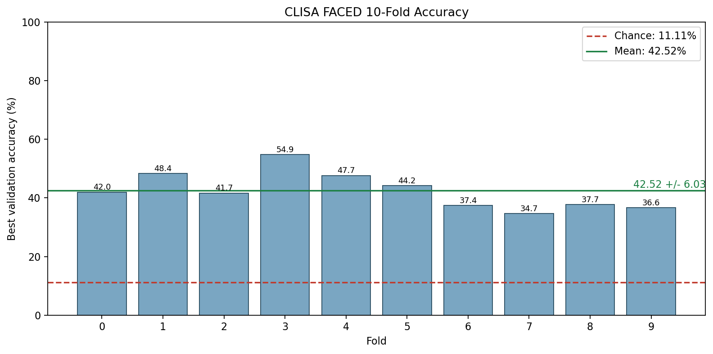
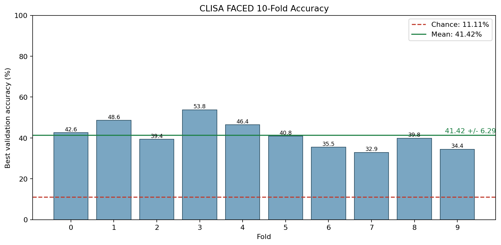
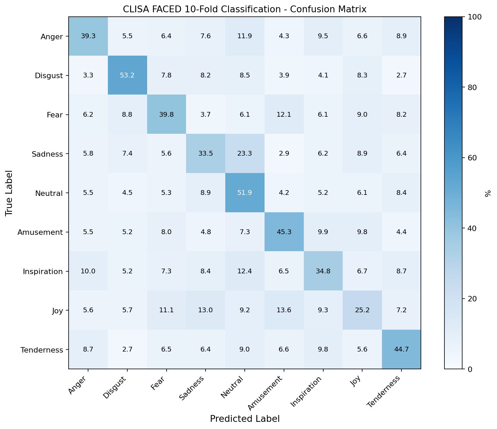

# CLISA EEG Emotion Reproduction

本仓库整理了 CLISA/FACED 9-class EEG 情感识别的本地复现流程。目标是让其他人拉取仓库后，只需要准备 FACED processed data，按照 README 放置数据并执行命令，就可以完整跑通：

```text
pretrain -> extract_fea -> train_mlp -> visualize
```

仓库同时保留了一个原仓库历史参考结果，以及两套本机 6-GPU fold 并行完整运行结果。大体积输入数据和中间特征不随 GitHub 上传，轻量级结果、日志、配置和可视化图片已经保留。

## 快速复现

1. 克隆仓库并进入目录。

```bash
git clone https://github.com/LJL-6666/clisa-eeg-emotion.git
cd clisa-eeg-emotion
```

2. 创建环境。

```bash
conda env create -f environment.yml
conda activate clisa-code
```

如果不使用 conda，可退回到：

```bash
pip install -r requirements.txt
```

3. 放置 FACED processed data。

默认 0.05-47 Hz 数据放在：

```text
runtime_inputs/Processed_data/
  sub000.pkl
  sub001.pkl
  ...
  sub122.pkl
```

代码同时支持 `sub*.pkl` 和 `sub*.mat`。仓库已经包含 `runtime_inputs/after_remarks/sub*/After_remarks.mat`，一般不需要额外准备。

4. 跑默认复现协议。

```bash
CONDA_ENV=clisa-code bash scripts/run_local_faced_reference.sh
```

输出会写到 `runs/run_<UTC time>/`，其中 `visualization/` 下会生成 fold accuracy、subject accuracy 和 confusion matrix。

## 结果总览

| 结果口径 | 数据分支 | 运行方式 | 结果目录 | 10-fold mean | overall | subject mean +/- std |
| --- | --- | --- | --- | ---: | ---: | ---: |
| 单卡顺序 0.05-47 Hz | external `Processed_data`, 0.05-47 Hz | 原仓库保留 reference，单进程顺序 10-fold | `results/processed_data_full_fixed_v4_lds_forward/` | `42.5230%` | `42.3790%` | `42.3790% +/- 13.6889%` |
| 6-GPU fold 并行 4-47 Hz | `runtime_inputs/Processed_data-clisa`, 4-47 Hz | 本机新跑 A，按 fold 拆成多进程并行 | `runs/run_6gpu_full_current/` | `40.1986%` | `40.1055%` | `40.1055% +/- 12.3194%` |
| 6-GPU fold 并行 0.05-47 Hz | `runtime_inputs/Processed_data`, 0.05-47 Hz | 本机新跑 B，按 fold 拆成多进程并行 | `runs/run_processed_005_47_full_current/` | `41.4222%` | `41.2505%` | `41.2505% +/- 14.0089%` |

更细的 fold-level score、路径和运行来源见 [docs/run_history.md](docs/run_history.md)。

## 仓库结构

| 路径 | 作用 |
| --- | --- |
| `main.py` | 推荐的本地统一入口，串联四个阶段。 |
| `train_ext.py` | CLISA 对比学习预训练。 |
| `extract_fea.py` | 特征提取、running normalization、LDS smoothing。 |
| `train_mlp.py` | 下游 MLP 分类器训练。 |
| `visualize_daest_results.py` | 聚合预测结果并生成可视化。 |
| `cfgs/` | Hydra 配置。 |
| `data/`, `model/`, `utils/` | 数据读取、模型和工具函数。 |
| `preprocessing/` | 可选的 FACED raw EEG 到 processed data 预处理流程。 |
| `runtime_inputs/after_remarks` | 已随仓库提供的 FACED 视频顺序和备注文件。 |
| `runtime_inputs/Processed_data` | 默认 0.05-47 Hz processed data 放置目录，不随 GitHub 上传。 |
| `runtime_inputs/Processed_data-clisa` | 可选 4-47 Hz CLISA 分支数据目录，不随 GitHub 上传。 |
| `results/` | 原仓库历史参考结果。 |
| `runs/` | 本机新跑结果和轻量级输出。 |

## 数据准备

FACED 数据集需要用户自行下载和放置，仓库不上传原始或 processed EEG 数据。可参考 FACED 数据链接：<https://cloud.tsinghua.edu.cn/d/4b573279ab1d4e9fb04a/>。

默认复现使用 `runtime_inputs/Processed_data`，对应 0.05-47 Hz processed data。这也是原仓库历史参考结果和本机新跑 B 使用的数据分支。

如果要复现 4-47 Hz CLISA 分支，需要额外准备：

```text
runtime_inputs/Processed_data-clisa/
  sub000.pkl
  ...
  sub122.pkl
```

数据目录必须包含 123 个 subject 文件，编号从 `sub000` 到 `sub122`。如果数据放在其他位置，运行时显式传入 `DATA_ROOT=/abs/path/to/Processed_data` 或 `--data-root /abs/path/to/Processed_data` 即可。

如果手里只有 FACED raw EEG，可以使用预处理流程：

```bash
cd preprocessing
python main.py --clisa-or-not yes
```

`--clisa-or-not yes` 会在 ICA 等步骤之后同时写出主分支和 4-47 Hz CLISA 分支。运行前需要根据本机路径修改 `preprocessing/main.py` 里的 `foldPaths`、`data_dir`、`save_dir` 和 `clisa_save_dir`。更多说明见 [preprocessing/README.md](preprocessing/README.md)。

## 复现命令

### 单卡顺序 0.05-47 Hz

这是推荐的 reference comparison 协议，和仓库保留的原历史结果口径一致。

```bash
python main.py \
  --data-root ./runtime_inputs/Processed_data \
  --after-remarks-dir ./runtime_inputs/after_remarks \
  --output-root ./runs \
  --data-config FACED_def \
  --model-config cnn_clisa \
  --valid-method 10 \
  --run-id 1 \
  --pretrain-epochs 80 \
  --mlp-epochs 100 \
  --extract-batch-size 2048 \
  --mlp-batch-size 512 \
  --mlp-wd 0.0022 \
  --pretrain-checkpoint best \
  --num-workers 0 \
  --lds-given-all 0
```

等价 wrapper：

```bash
CONDA_ENV=clisa-code bash scripts/run_local_faced_reference.sh
```

### 6-GPU fold 并行 4-47 Hz

该脚本将 10 个 fold 拆成独立进程，并通过 `CLISA_FOLDS` 分配到多张 GPU。它用于本机新跑 A。

```bash
CONDA_ENV=clisa-code \
DATA_ROOT=./runtime_inputs/Processed_data-clisa \
OUTPUT_RUN_ROOT=./runs/run_6gpu_full_current \
bash scripts/run_faced_6gpu_full_after_upload.sh
```

### 6-GPU fold 并行 0.05-47 Hz

该脚本用于本机新跑 B，并且默认拒绝把结果写入 4-47 Hz 的输出目录。

```bash
CONDA_ENV=clisa-code \
DATA_ROOT=./runtime_inputs/Processed_data \
OUTPUT_RUN_ROOT=./runs/run_processed_005_47_full_current \
bash scripts/run_processed_005_47_after_upload.sh
```

如果要重新跑一套新结果，请把 `OUTPUT_RUN_ROOT` 改成新的目录，避免覆盖已有输出。

## 分阶段运行

只跑预训练：

```bash
python main.py \
  --data-root ./runtime_inputs/Processed_data \
  --after-remarks-dir ./runtime_inputs/after_remarks \
  --output-root ./runs \
  --data-config FACED_def \
  --model-config cnn_clisa \
  --valid-method 10 \
  --run-id 1 \
  --pretrain-epochs 80 \
  --mlp-epochs 100 \
  --extract-batch-size 2048 \
  --mlp-batch-size 512 \
  --mlp-wd 0.0022 \
  --pretrain-checkpoint best \
  --num-workers 0 \
  --lds-given-all 0 \
  --stages pretrain
```

在已有 `run_root` 上继续跑 `extract + mlp + visualize`：

```bash
python main.py \
  --resume-run-root /abs/path/to/runs/run_YYYYMMDDTHHMMSSZ \
  --lds-given-all 0 \
  --pretrain-checkpoint best \
  --stages extract,mlp,visualize
```

如果预训练是外部进程继续补齐的，可以等待所有 fold 的 `last.ckpt` 达到目标 epoch 后再继续：

```bash
python main.py \
  --resume-run-root /abs/path/to/runs/run_YYYYMMDDTHHMMSSZ \
  --lds-given-all 0 \
  --pretrain-checkpoint best \
  --stages extract,mlp,visualize \
  --wait-pretrain-last-epochs 80
```

只重画图：

```bash
python main.py \
  --resume-run-root /abs/path/to/runs/run_YYYYMMDDTHHMMSSZ \
  --stages visualize \
  --force-stages visualize
```

也可以直接调用可视化脚本：

```bash
python visualize_daest_results.py \
  --run-root /abs/path/to/run_root \
  --run 1 \
  --mode de \
  --device cpu
```

## 输出目录

每次完整运行会生成一个独立 `run_root`：

```text
runs/<run_id_or_timestamp>/
  checkpoints/
  data/
  hydra_runs/
  stage_logs/
  stage_status/
  visualization/
  run.log
```

关键结果文件：

| 文件 | 说明 |
| --- | --- |
| `visualization/daest_faced_visualization_summary_de.json` | overall、subject mean/std、fold mean 等汇总指标。 |
| `visualization/daest_faced_10fold_fold_accuracy_de.png` | 10-fold 准确率图。 |
| `visualization/daest_faced_10fold_subject_accuracy_de.png` | subject-level 准确率图。 |
| `visualization/daest_faced_10fold_cls9_confusion_de.png` | 9-class confusion matrix。 |
| `stage_logs/*.log` | 各阶段运行日志。 |

## 可视化结果

同一指标的三套结果放在同一行，便于横向比较。图片使用 HTML 控制宽度，GitHub README 中会按列缩放显示。

### Fold accuracy

<table>
  <tr>
    <th>单卡顺序 0.05-47 Hz</th>
    <th>6-GPU fold 并行 4-47 Hz</th>
    <th>6-GPU fold 并行 0.05-47 Hz</th>
  </tr>
  <tr>
    <td></td>
    <td></td>
    <td></td>
  </tr>
</table>

### Subject accuracy

<table>
  <tr>
    <th>单卡顺序 0.05-47 Hz</th>
    <th>6-GPU fold 并行 4-47 Hz</th>
    <th>6-GPU fold 并行 0.05-47 Hz</th>
  </tr>
  <tr>
    <td></td>
    <td></td>
    <td></td>
  </tr>
</table>

### Confusion matrix

<table>
  <tr>
    <th>单卡顺序 0.05-47 Hz</th>
    <th>6-GPU fold 并行 4-47 Hz</th>
    <th>6-GPU fold 并行 0.05-47 Hz</th>
  </tr>
  <tr>
    <td></td>
    <td></td>
    <td></td>
  </tr>
</table>

## 当前复现设置

| 项 | 当前值 |
| --- | --- |
| Dataset config | `FACED_def` |
| Model config | `cnn_clisa` |
| Task | FACED 9-class, 10-fold cross-subject |
| Feature mode | `de` |
| Pretrain epochs | `80` |
| MLP epochs | `100` |
| MLP weight decay | `0.0022` |
| Input normalization | `ext_fea.normTrain=True` |
| Running normalization | `ext_fea.use_running_norm=True` |
| LDS | `ext_fea.use_lds=True` |
| LDS mode | `ext_fea.lds_given_all=0`, forward filtering only |
| Pretrain checkpoint for extraction | `best` |

当前训练命令设置 `min_epochs=max_epochs`，因此会按固定 epoch 跑完；`patience` 不会让训练提前停止。LDS 在每个 video sequence 内做平滑，不跨 video 平滑。

## 上传与忽略的文件

已上传到 GitHub：

- 代码、配置、启动脚本、README 和 docs。
- 可视化 PNG、CSV、JSON 汇总、小体积 prediction `.npz`。
- stage logs、Hydra 配置和轻量 checkpoint。

没有上传：

- FACED processed data：`runtime_inputs/Processed_data*`。
- 大体积 sliced arrays：`runs/*/data/sliced_data/`。
- 大体积 extracted feature arrays：`runs/*/data/ext_fea/`。

这些路径已写入 `.gitignore`，避免误提交大文件。

## 复现注意事项

- 原仓库历史参考结果应按“单卡顺序 0.05-47 Hz”理解，不应和 4-47 Hz CLISA 分支混在一起。
- 6-GPU fold 并行可以更快打满 GPU，但每个 fold 是独立进程，随机数推进轨迹不同，因此不保证和单进程顺序 10-fold 逐位一致。
- 如果要和历史 reference 做严格对比，建议单独跑一套单进程顺序 0.05-47 Hz 结果，并写入新的 `runs/` 目录。
- 做横向比较时应固定 `data-root`、`after-remarks-dir`、`run-id`、`pretrain-checkpoint`、`lds-given-all` 和运行方式。
